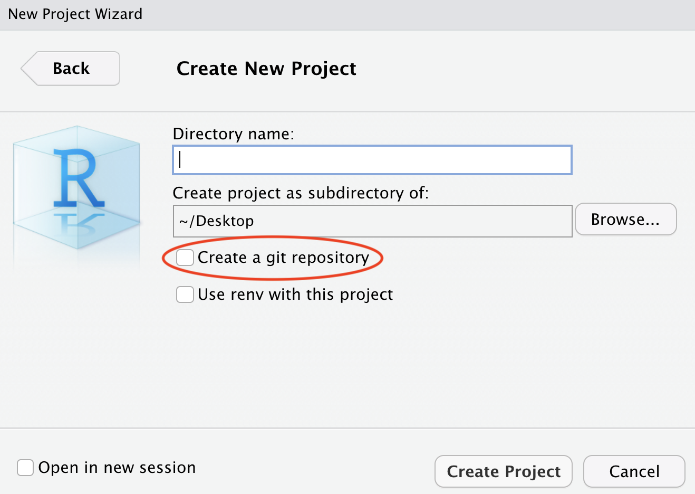

The goal of this first exercise is to make sure that all of your software is installed properly and working.

1. By now, you should have received an `inspace` link via Slack and Teams to join our first meeting on Tuesday January 18th at 1:15 pm. We may decide to switch to a different platform later in the course, but for now we will start with `inspace` The lectures are "scheduled" for 1:15 pm on Tuesdays and Thursdays for the first few weeks. You will watch the videos and code along with them on your own schedule. I will notify the class when we transition back to in-person lectures.

2. Make sure everything is set up and working on the laptop that you will be using for this course. 

Specifically, you should have the most current versions of R and RStudio installed. Within R, you need the `tinytex` package installed so that can create ("knit") pdf documents.

You also need the latest version of [Typora](https://typora.io/) (a markdown editor), [Inkscape](https://inkscape.org/release/inkscape-1.1.1/),  a plain text editor (BBEdit for Macs, or Notepad++ for Windows). And you need to be signed up for a GitHub account and have handy your github user name and password. An installation and troubleshooting guide for the various programs is linked [here](Installation_Instructions.html). 

Lauren will make a brief presentation and step you through a series of checks to make sure you are ready to go on all of these things.

Due by the end of lab:    

* A PDF of the 'default' text and code knitted in RStudio (this ensures `tinytex` is working)
* The link to your github repository: `https://github.com/YourUserName`
* Show one of the TAs that you have the option to 'create a git repository' when creating a new project, as shown below:

{width=30%} 

